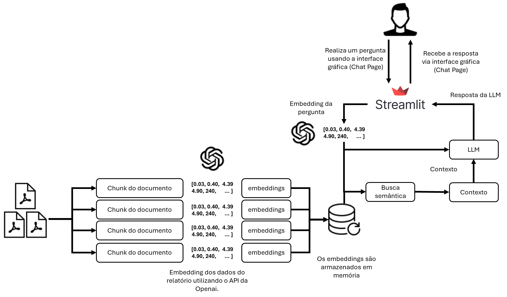
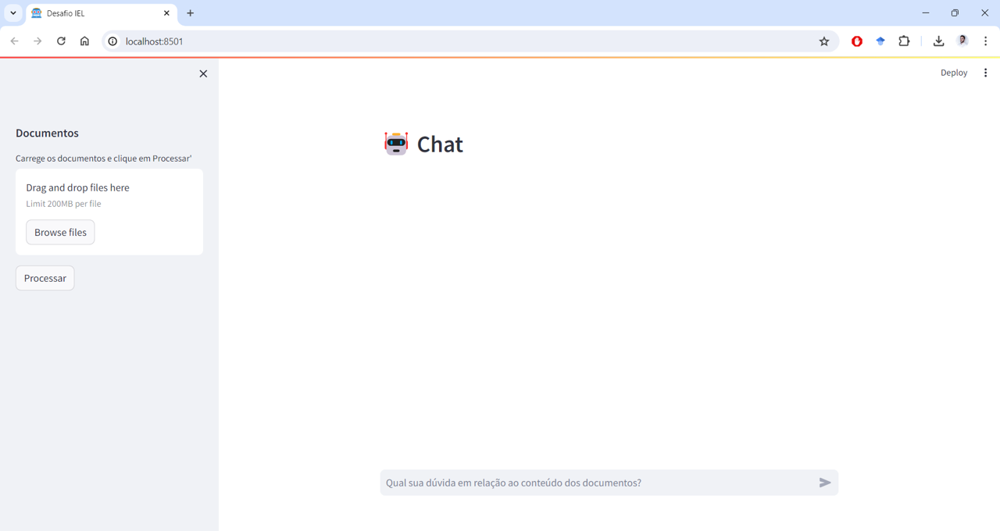

# Desafio Programa Inova Talentos - Radix
> Autor: Gilvan Wanderley de Farias Neto
---------------
## Descrição do Desafio
Elabore um sistema baseado em RAG (Retrieval Augmented Generation) aplicado a documentos financeiros (relatórios, artigos, quaisquer documentações da área).

## Descrição da Solução

O aplicativo segue estas etapas para fornecer respostas às suas perguntas:

* **Carregamento de PDF**: O aplicativo lê vários documentos PDF e extrai seu conteúdo de texto.

* **Text Chunking**: o texto extraído é dividido em pedaços menores que podem ser processados ​​de forma eficaz.

* **Modelo de linguagem**: O aplicativo utiliza um modelo de linguagem para gerar representações vetoriais (incorporação) dos pedaços de texto.

* **Correspondência de similaridade**: quando você faz uma pergunta, o aplicativo a compara com os blocos de texto e identifica os mais semanticamente semelhantes.

* **Geração de Resposta**: Os pedaços selecionados são passados ​​para o modelo de linguagem, que gera uma resposta baseada no conteúdo relevante dos PDFs.

## Dependências e Instalação

### Instalação Usando Poetry

```
poetry shell
poetry install
```

### Instalação Usando Pip

```
pip install -r requirements.txt
```

## Utilização
Para inicializar o Chat, siga estas etapas:
* Certifique-se de estar com o ambiente ativiado, ter instalado as dependências necessárias e adicionado a chave de API OpenAI ao arquivo .env.
* Execute o arquivo app.py usando o Streamlit. Execute o seguinte comando:
```
streamlit run app.py
```
* O aplicativo será iniciado em seu navegador padrão, exibindo a interface do usuário.

* Carregue vários ou um documentos PDF no aplicativo seguindo as instruções fornecidas.
* Faça perguntas em sobre os PDFs carregados usando a interface de chat.